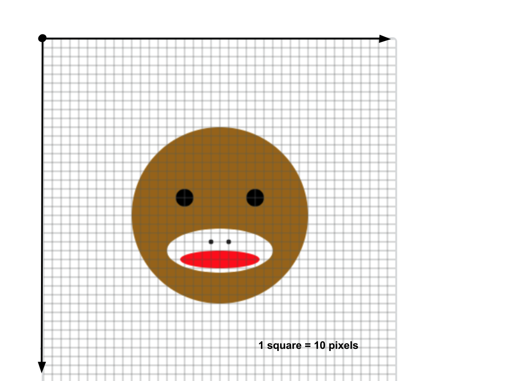

# SockMonkey Drawing with Variables
Add some tick marks, guidelines, dimensions, and labels (in pencil).
* Where is the center of the monkey? (The x and y coordinates)
* How wide is the monkey?
* How tall is the monkey?
* How far is each eye from the center?
* How wide is each eye? 
* How tall is each eye?
* Where is the center of the mouth?
* If I decided I wanted to change the size of the monkey’s eyes, how many values would I need to change in the code?



Variable - a name of a memory location used to store a value. That value can change (or vary) throughout the program.
Variables are like buckets, they hold stuff…)
```javascript
// Declare a variable above setup
		
// Initialize the variable in the setup function 

// Both at the same time
		
// Note that x = 3 is not the same as 3 = x
```

The **camelCase** naming Convention: Variables should start with a lowercase letter! Then, if longer than one word, the second words should start with an uppercase letter (no spaces between words).

When to declare/initialize? 

## Programming TODO List
1. Declare a variable called `xPos` that will hold the x coordinate of the center of the monkey.
2. Initialize `xPos` to `200`, the x-coordinate of the center of the monkey.  Remember you need to declare and initialize variables at the top (or at least before you use them).  The computer reads the instructions from top to bottom.
3. Replace the `200` in the head ellipse with the variable `xPos`.
4. Add `xPos = mouseX;` to the bottom of the `draw` function, (just before the closing curly brace `}`). Now when you run the program, you should see the head of the monkey move left and right.  The rest of the monkey will not move with it, yet.
5. The head of the monkey, should be stamping on the canvas. to fix this we need to redraw the background at the top of the `draw` function. Add `background(#,#,#);` to the beginning of the `draw` function. You can choose any 3 numbers you want.
6. Start by replacing the x-coordinate of the monkey’s right eye, with the expression `xPos + 40`.  We add 40 because the right eye is 40 pixels to the right of the center `xPos` of the monkey.
7. Continue to change all of the x-coordinates of the other monkey features so that they are written as an expression representing their relation to the center of the monkey.
8. When you are done, the entire monkey drawing should mover left and right with the mouse.

9. Change the frame rate to 30 frames per second inside the setup function with the function `frameRate(30);`
10. Add a second variable to hold the y position (named `yPos`) of the monkey at the top of the program.
11. Repeat what you did for all of the x positions but for the y positions. This will allow the monkey to move up and down as well as left and right.
12. Add the following line of code to the bottom of the `draw` loop. `yPos = mouseY;`

When you complete the SockMonkey TODO list, submit your worksheet and get your Sock Monkey program graded.
